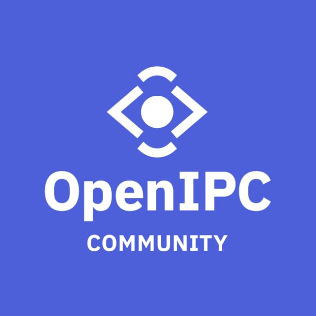

# Contributing

Many core team members donate their knowledge and their free time to work on the project,
often using their personal funds to buy cameras to expand the list of supported hardware.
Your donation help us to ease the burden on their personal finances while keeping the
development on the latest hardware. We also use the funds to compensate the work of part-time
and full-time maintainers, and to attend trade shows, meet with hardware vendors, monitor
trends in camera technology and gain access to SDK and other support materials, which are
often expensive. Your contributions help us to continue development and provide technical
support to the community.

